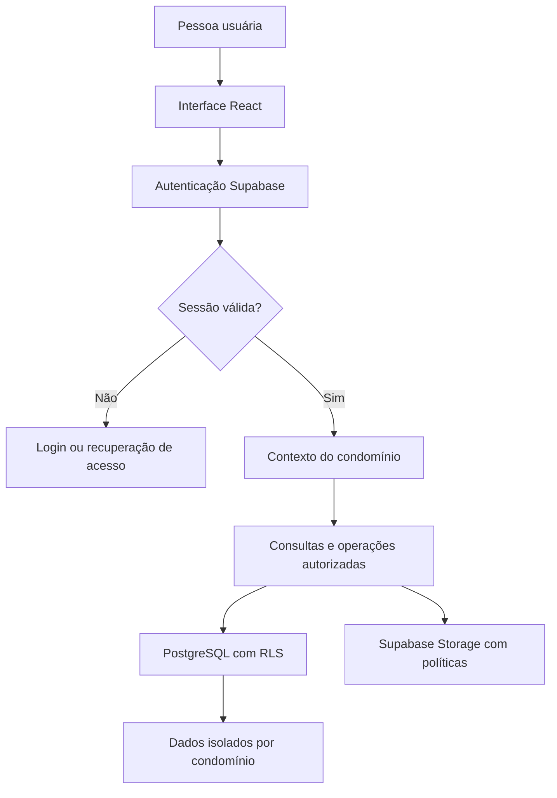

<!--
  SindCoop — documentação do projeto
  Mantenha este README alinhado ao que estiver realmente implementado.
-->

<div align="center">

# 🏢 SindCoop

### Seu condomínio organizado em um só lugar.

**Gestão simples, segura e inteligente para pequenos condomínios.**

<p>
  <a href="https://devkove.github.io/resident-realm-roots/">
    
  </a>
  <a href="https://github.com/DevKove/resident-realm-roots">
    
  </a>
</p>

<p>
  
  
  
  
  
</p>

<p><em>Uma base moderna para centralizar a rotina condominial, reduzir tarefas manuais e facilitar o acesso às informações.</em></p>

</div>

---

## 🧭 Navegação

- [✨ Visão geral](#-visão-geral)
- [🎯 Objetivos](#-objetivos)
- [🧩 Módulos planejados](#-módulos-planejados)
- [👥 Perfis de acesso](#-perfis-de-acesso)
- [🛠️ Tecnologias](#️-tecnologias)
- [🏗️ Arquitetura](#️-arquitetura)
- [🚀 Executar localmente](#-executar-localmente)
- [🔐 Configuração do Supabase](#-configuração-do-supabase)
- [🗂️ Estrutura do projeto](#️-estrutura-do-projeto)
- [🛡️ Segurança e privacidade](#️-segurança-e-privacidade)
- [🧪 Testes e validação](#-testes-e-validação)
- [🌍 Publicação](#-publicação)
- [🗺️ Evolução do produto](#️-evolução-do-produto)
- [🤝 Contribuição](#-contribuição)
- [📄 Licença](#-licença)

## ✨ Visão geral

O **SindCoop** é um projeto de plataforma web para apoiar a administração de condomínios residenciais de pequeno e médio porte. A proposta é reunir, em um ambiente organizado, as principais rotinas do síndico, da administração, dos moradores e da portaria.

A experiência está sendo construída com interface responsiva, autenticação, contexto de condomínio e uma arquitetura preparada para separar os dados de cada organização.

> **Estado do projeto:** em desenvolvimento ativo. A presença de um módulo na visão do produto não significa que todas as suas regras, telas e operações já estejam concluídas. Consulte a aplicação e os testes antes de utilizar o sistema em uma operação real.

<div align="center">

| 🏠 Organização | 🔒 Controle de acesso | 📱 Acesso web |
|:---:|:---:|:---:|
| Informações centralizadas | Separação de dados por condomínio | Interface responsiva |

</div>

## 🎯 Objetivos

- Centralizar informações administrativas e operacionais do condomínio.
- Facilitar a comunicação entre gestão e moradores.
- Organizar o acompanhamento de ocorrências e solicitações.
- Apoiar reservas de áreas comuns e rotinas da portaria.
- Criar uma base para documentos, relatórios e controles financeiros.
- Aplicar permissões por perfil e isolamento de dados entre condomínios.
- Evoluir com manutenção rastreável, testes e migrations versionadas.

## 🧩 Módulos planejados

A estrutura do produto está organizada por áreas funcionais. O quadro abaixo representa o **escopo do SindCoop**, não uma declaração de que todos os recursos estão finalizados.

| Área | Escopo previsto |
|---|---|
| 📊 **Painel** | Resumo das atividades e indicadores do condomínio |
| 🏢 **Condomínio** | Dados do condomínio, unidades, moradores, funcionários, veículos e animais |
| 📣 **Comunicação** | Avisos, mural, notificações e enquetes |
| 🧰 **Ocorrências** | Registro, acompanhamento, comentários e histórico |
| 📅 **Reservas** | Áreas comuns, solicitações, calendário e prevenção de conflitos de horário |
| 🚪 **Portaria** | Visitantes, entregas e registros de acesso |
| 📁 **Documentos** | Arquivos, atas, regulamento, convenção e comunicados |
| 💰 **Financeiro** | Receitas, despesas, cobranças, inadimplência e relatórios |
| 📈 **Relatórios** | Consultas administrativas e operacionais |
| ⚙️ **Administração** | Usuários, permissões, configurações e auditoria |
| 🧑‍💼 **Plataforma SaaS** | Planos, assinaturas, período de avaliação e administração global |

## 👥 Perfis de acesso

O modelo de autorização prevê permissões diferentes conforme a responsabilidade de cada pessoa:

| Perfil | Responsabilidade esperada |
|---|---|
| **Super administrador** | Administração global da plataforma, planos e condomínios |
| **Administrador do condomínio** | Configuração e gestão do ambiente condominial |
| **Síndico** | Acompanhamento das rotinas e administração permitida |
| **Subsíndico** | Apoio à gestão conforme permissões atribuídas |
| **Morador** | Acesso aos próprios dados e às informações liberadas aos moradores |
| **Funcionário** | Acesso operacional limitado à sua função |
| **Porteiro** | Rotinas autorizadas de portaria, visitantes, entregas e acessos |

As permissões precisam ser aplicadas no backend e no banco de dados, e não somente por ocultação de botões ou menus na interface.

## 🛠️ Tecnologias

<div align="center">

| Camada | Tecnologia | Uso |
|---|---|---|
| Interface | React 19 | Componentes e experiência de usuário |
| Linguagem | TypeScript | Tipagem estática |
| Aplicação e rotas | TanStack Start / Router | Estrutura e navegação |
| Estilos | Tailwind CSS 4 | Layout responsivo e estilos |
| Ícones | Lucide React | Ícones da interface |
| Backend gerenciado | Supabase | Serviços de backend |
| Identidade | Supabase Auth | Autenticação e sessões |
| Banco de dados | PostgreSQL | Persistência relacional |
| Autorização de dados | PostgreSQL RLS | Políticas de acesso por linha |
| Arquivos | Supabase Storage | Armazenamento de documentos com políticas |
| Testes | Vitest | Execução de testes automatizados |
| Build | Vite | Compilação da aplicação |
| Validação | Zod / React Hook Form | Apoio à validação de formulários |

</div>

## 🏗️ Arquitetura

O fluxo simplificado da aplicação é representado abaixo:



### Princípios de arquitetura

1. **Separação por condomínio:** as operações devem validar a associação do usuário ao condomínio solicitado.
2. **Autorização no servidor/banco:** o frontend não é uma fronteira de segurança.
3. **Migrations versionadas:** mudanças de estrutura devem ser registradas e revisadas.
4. **Segredos fora do código:** chaves privadas e credenciais administrativas nunca devem ser publicadas no navegador.
5. **Falhas tratadas:** estados de carregamento, erro e ausência de dados devem ser apresentados com clareza.

## 🚀 Executar localmente

### Pré-requisitos

- Node.js compatível com a versão usada pelo projeto — recomenda-se Node.js 22 para alinhar ao workflow de publicação.
- npm.
- Um projeto Supabase para autenticação e dados.

### 1. Obter o código

```bash
git clone https://github.com/DevKove/resident-realm-roots.git
cd resident-realm-roots
```

### 2. Instalar dependências

```bash
npm install
```

### 3. Configurar as variáveis de ambiente

Copie o arquivo de exemplo, caso esteja presente no checkout:

**Windows PowerShell**
```powershell
Copy-Item .env.example .env
```

**Linux / macOS**
```bash
cp .env.example .env
```

Preencha as variáveis públicas do projeto Supabase descritas na seção seguinte. Não publique o arquivo `.env`.

### 4. Iniciar o ambiente de desenvolvimento

```bash
npm run dev
```

O Vite exibirá no terminal o endereço local em que a aplicação estará disponível.

### 5. Verificar a compilação

```bash
npm run build
npm run preview
```

> Se algum comando falhar, confira a versão do Node.js, a instalação das dependências, as variáveis de ambiente e a mensagem completa do terminal.

## 🔐 Configuração do Supabase

A aplicação utiliza variáveis de ambiente com prefixo `VITE_`, destinadas a valores que podem ser incluídos no bundle do navegador. Configure os nomes abaixo conforme o cliente Supabase do projeto:

```env
VITE_SUPABASE_URL=https://SEU-PROJETO.supabase.co
VITE_SUPABASE_PUBLISHABLE_KEY=SUA_CHAVE_PUBLICAVEL
```

- **`VITE_SUPABASE_URL`**: URL do projeto Supabase.
- **`VITE_SUPABASE_PUBLISHABLE_KEY`**: chave publicável apropriada para uso no cliente, protegida por políticas RLS.

O cliente pode possuir valores de fallback definidos no código para o ambiente publicado. Para desenvolvimento local, prefira configurar o arquivo de ambiente.

### Banco de dados e migrations

As migrations do projeto ficam em `supabase/migrations/`. Antes de aplicar uma migration em um ambiente compartilhado ou de produção:

1. Revise o SQL e as permissões afetadas.
2. Confira as chaves estrangeiras, índices, constraints e políticas RLS.
3. Teste em ambiente de desenvolvimento.
4. Verifique os fluxos de autenticação e isolamento entre condomínios.
5. Registre e revise qualquer alteração manual feita diretamente no banco.

Não execute SQL desconhecido diretamente em produção.

## 🗂️ Estrutura do projeto

A estrutura exata pode evoluir, mas os principais diretórios seguem esta organização:

```text
resident-realm-roots/
├── public/                  # Arquivos estáticos
├── src/
│   ├── components/          # Componentes reutilizáveis
│   ├── integrations/
│   │   └── supabase/        # Cliente e integração Supabase
│   ├── lib/                 # Funções e regras compartilhadas
│   ├── routes/              # Rotas e páginas da aplicação
│   └── styles.css           # Estilos globais
├── supabase/
│   └── migrations/          # Histórico versionado do schema
├── .env.example             # Exemplo de configuração, se disponível
├── package.json             # Dependências e scripts
├── vite.config.github.ts    # Configuração de build para GitHub Pages
└── README.md                # Documentação do projeto
```

## 🛡️ Segurança e privacidade

Segurança é requisito central para uma aplicação que pode tratar dados pessoais e financeiros.

### Regras essenciais

- Ativar **Row Level Security (RLS)** em todas as tabelas expostas que armazenem dados protegidos.
- Criar políticas específicas para leitura, inserção, atualização e exclusão.
- Validar associação e permissão no banco para cada operação sensível.
- Impedir que um morador consulte dados privados de outro morador sem autorização.
- Impedir que um usuário de um condomínio acesse registros de outro condomínio, mesmo alterando IDs ou URLs.
- Restringir auditoria, configurações administrativas, assinaturas e dados financeiros conforme o perfil.
- Usar buckets privados e políticas de Storage para arquivos restritos.
- Validar tipo, tamanho e conteúdo de arquivos enviados.
- Não armazenar senhas em texto puro nem expor tokens ou credenciais privadas.
- Evitar confiar em metadados editáveis pelo usuário para decisões de autorização.
- Minimizar os dados pessoais exibidos e observar os princípios da LGPD.

### ⚠️ Chaves e credenciais

**Nunca** coloque `service_role`, senhas de banco, tokens administrativos ou segredos de servidor em:

- código React executado no navegador;
- variáveis `VITE_*`;
- commits, issues ou logs públicos;
- capturas de tela ou documentação pública.

Uma chave publicável não substitui RLS. A segurança depende de políticas corretas e testadas.

### Verificações recomendadas antes de produção

- [ ] Testar acesso cruzado entre dois condomínios.
- [ ] Testar permissões de cada perfil em cada operação.
- [ ] Revisar todas as políticas RLS e de Storage.
- [ ] Revisar exposição de dados pessoais e financeiros.
- [ ] Testar recuperação de senha, expiração e encerramento de sessão.
- [ ] Validar formulários tanto no cliente quanto no backend.
- [ ] Revisar logs, mensagens de erro e tratamento de exceções.
- [ ] Executar testes automatizados e revisão de dependências.
- [ ] Configurar backups, monitoramento e processo de resposta a incidentes.

## 🧪 Testes e validação

Scripts disponíveis no projeto:

| Comando | Finalidade |
|---|---|
| `npm run lint` | Verificar problemas de lint |
| `npm test` | Executar a suíte Vitest uma vez |
| `npm run test:watch` | Executar testes em modo de observação |
| `npm run build` | Compilar a aplicação para produção |
| `npm run dev` | Iniciar o servidor de desenvolvimento |

Execute antes de enviar alterações:

```bash
npm run lint
npm test
npm run build
```

### Cenários funcionais importantes

- Cadastro, confirmação de e-mail, login, logout e recuperação de senha.
- Criação e acesso ao contexto do condomínio.
- Operações autorizadas de consulta, criação, edição e exclusão.
- Restrições de acesso por papel.
- Isolamento total entre condomínios.
- Estados de carregamento, erro e lista vazia.
- Upload e download de documentos privados.
- Layout em telas pequenas e navegação por teclado.

> Um build bem-sucedido confirma a compilação; não comprova sozinho a segurança, a correção das permissões ou a conclusão de todos os módulos.

## 🌍 Publicação

A versão web é publicada pelo GitHub Pages:

**Aplicação:** https://devkove.github.io/resident-realm-roots/

**Repositório:** https://github.com/DevKove/resident-realm-roots

O workflow de publicação está em `.github/workflows/`. Ele compila a aplicação usando a configuração `vite.config.github.ts`, que define o caminho-base do projeto para o GitHub Pages.

### Após uma alteração

1. Faça as alterações em uma branch adequada.
2. Execute lint, testes e build.
3. Revise os arquivos modificados e remova segredos acidentais.
4. Envie o commit para o GitHub.
5. Acompanhe **Actions** no repositório e confirme que o workflow terminou com sucesso.
6. Verifique a página publicada, incluindo login, rotas internas, recarga direta e console do navegador.

A publicação estática do frontend não significa que o backend, os dados, as regras de negócio ou os módulos estejam automaticamente prontos para uso comercial.

## 🗺️ Evolução do produto

A evolução deve priorizar segurança, confiabilidade e valor real para o condomínio:

- [ ] Consolidar a fundação, autenticação e onboarding.
- [ ] Revisar permissões e isolamento multi-tenant.
- [ ] Completar cadastro e gestão de unidades e moradores.
- [ ] Completar o fluxo de ocorrências.
- [ ] Completar reservas e prevenção de conflitos.
- [ ] Completar visitantes, entregas e registros de portaria.
- [ ] Completar documentos e permissões de arquivos.
- [ ] Completar receitas, despesas, cobranças e relatórios financeiros.
- [ ] Implementar notificações e atualizações em tempo real onde necessário.
- [ ] Completar relatórios, auditoria e administração da plataforma.
- [ ] Finalizar planos, período de avaliação e cobrança recorrente.
- [ ] Automatizar testes de integração, autorização e isolamento entre condomínios.
- [ ] Realizar revisão de segurança e validação operacional antes do lançamento comercial.

## 🤝 Contribuição

Contribuições, relatos de bugs e sugestões são bem-vindos.

1. Abra uma issue descrevendo o problema ou a melhoria.
2. Para mudanças maiores, discuta a proposta antes de implementar.
3. Crie uma branch com nome descritivo.
4. Faça alterações pequenas e objetivas.
5. Rode lint, testes e build.
6. Abra um Pull Request com contexto, impacto, evidências e passos para testar.

### Padrões recomendados

- Interface e mensagens em português brasileiro.
- Componentes reutilizáveis e acessíveis.
- Validação explícita de dados.
- Migrations para mudanças no banco.
- Políticas RLS revisadas junto com cada mudança de acesso.
- Nenhum botão crítico sem ação funcional.
- Nenhuma funcionalidade apresentada como concluída sem implementação e teste correspondentes.

## 📄 Licença

Nenhuma licença de distribuição deve ser presumida apenas por este README. Consulte o arquivo de licença do repositório, se existir, ou defina formalmente uma licença antes de permitir reutilização e redistribuição.

---

<div align="center">

**SindCoop** · Seu condomínio organizado em um só lugar.

<sub>Construído com foco em organização, segurança e evolução contínua.</sub>

</div>
